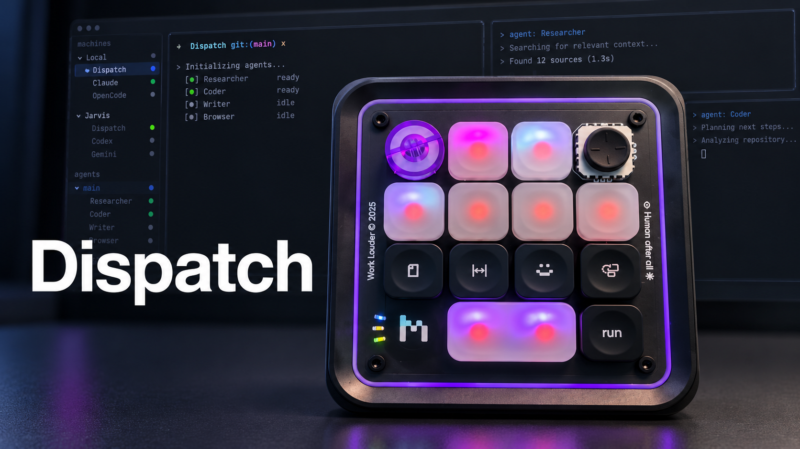

# Dispatch

[](https://x.com/peterjfoti/status/2105362766945304677)

Dispatch turns a [Work Louder Creator Micro 2](https://worklouder.cc/creator-micro-2) into a control surface for
[Herdr](https://herdr.dev) on macOS: each key shows one agent's status in
color, and one press jumps to that agent.

## Is this for you?

Dispatch is for you if you own a **Creator Micro 2** and run your coding agents
in **Herdr**. Keys can light up with each agent's state (blocked, working,
done, idle) and focus that agent when pressed, including agents on other
machines Herdr is connected to.

Every key, dial direction, and joystick direction can run any of Dispatch's
actions, or several in a row:

- **Herdr:** focus an agent by slot or name, cycle through agents, workspaces,
  or tabs, move between panes by direction, create a workspace, split or close
  a pane, and type text into the focused pane.
- **macOS:** press a keyboard shortcut, type text, open or switch to an app, or
  bring a specific window forward.

The [default controls](#default-controls) are one example setup. Without
Herdr, Dispatch offers little beyond what Work Louder's own editor already
does.

Dispatch uses the pad's first keymap layer, the one Work Louder's editor marks
"reserved for ChatGPT". If Codex's Creator Micro support has set up your pad,
that layer is already what Dispatch needs and nothing is written. Otherwise
Dispatch asks before replacing it and saves your current layout on the pad
first, so you can restore it (see [The keymap](#the-keymap)).

## Requirements

- A Creator Micro 2 (tested with firmware 0.6.2).
- macOS 14 or later.
- [Herdr](https://herdr.dev) 0.9.1 or later, running in
  [Ghostty](https://ghostty.org) or [iTerm2](https://iterm2.com). Terminal.app works for everything except moving through Herdr's
  window with the dial (see [Terminals](#terminals)).
- Xcode, or its command-line tools, to build Dispatch from source.

## Install

1. Clone this repository:
   ```sh
   git clone https://github.com/thefotes/Dispatch.git
   cd Dispatch
   ```
2. Optional but recommended: create a self-signed code-signing certificate
   named `Dispatch Local Dev`, following Apple's guide,
   [Create self-signed certificates in Keychain Access](https://support.apple.com/guide/keychain-access/create-self-signed-certificates-kyca8916/mac)
   (choose *Code Signing* as the certificate type). macOS ties Dispatch's
   permissions to its signature, and a certificate keeps that signature the
   same across rebuilds, so you grant permissions once. The build script finds
   the certificate by that exact name. If you have an Apple Developer ID, you
   can set `DISPATCH_CODESIGN_IDENTITY` to it instead.
3. Build the app:
   ```sh
   scripts/bundle.sh
   ```
4. Move it into Applications and open it:
   ```sh
   ditto build/Dispatch.app /Applications/Dispatch.app
   open /Applications/Dispatch.app
   ```

Dispatch lives in the menu bar. To start it when you log in, add it under
**System Settings → General → Login Items**.

## Permissions

Dispatch asks for two permissions. The menu-bar panel shows a button for each
until it is granted.

- **Input Monitoring** lets Dispatch talk to the pad. The pad's control channel
  shares a USB interface with its keyboard, so macOS treats opening it like
  reading a keyboard.
- **Accessibility** lets Dispatch press keys on your behalf, for keyboard
  shortcut actions and to bring your terminal forward for Herdr's window keys.

## The keymap

The pad only reports presses and accepts per-key lighting for special codes on
its first layer. When Dispatch connects, it checks that layer:

- **Already set up** (for example by Codex): Dispatch works at once.
- **Anything else:** the panel explains what setup changes and shows **Allow
  keymap setup**. Nothing is written until you click it. Dispatch then saves
  your current layout on the pad as `keymap.dispatch-backup.json`, verifies the
  backup, writes the new layer, and verifies it.
- **Changed since setup** (you edited it in Work Louder's editor): Dispatch
  asks whether to apply its layout again or keep yours, and never overwrites it
  silently.

To undo setup, click **Restore original keymap** in the panel. It writes the
backup back, verifies it, and turns keymap setup off so Dispatch doesn't set
the layer up again until you allow it. With Dispatch quit, the same restore is
available from this repository, in a terminal app that has Input Monitoring:

```sh
swift run dispatch-probe keymap-restore --write
```

## Set up Herdr

Dispatch talks to Herdr through its socket, so most actions work with no
setup. The exception is cycling through workspaces or agents with the dial.
That moves through Herdr's window, which lists every machine Herdr is
connected to, while the socket reaches one machine at a time. So Dispatch
brings the terminal forward and presses Herdr's own navigation keys. Dispatch
currently does this even if you only use Herdr on one machine, so add these
bindings to `~/.config/herdr/config.toml` and reload Herdr's configuration:

```toml
[keys]
previous_agent = "f16"
previous_workspace = "f17"
next_workspace = "f18"
next_agent = "f19"
```

If F16–F19 already do something on your Mac, pick other keys on both sides; see
[Window keys](docs/configuration.md#window-keys).

For agents on other machines, Dispatch uses the machines saved in Herdr and
reaches them over SSH without prompting, so each one needs key-based SSH
access that works non-interactively (`ssh -o BatchMode=yes <host> true`
succeeds).

### Terminals

For the dial's window moves, Dispatch brings the terminal running Herdr forward
and presses the bound key. Ghostty is the default. For iTerm2, add this to
`~/.config/dispatch/config.json`, keeping your existing bindings:

```json
"integrations": { "herdr": { "terminalBundleIdentifier": "com.googlecode.iterm2" } }
```

Terminal.app receives the keys but Herdr does not act on them, so the dial's
window moves don't work there. Everything else does.

## Default controls

```text
 ┌──────┬──────┬──────┬──────────┐
 │ dial │  0   │  1   │ joystick │
 ├──────┼──────┼──────┼──────────┤
 │  2   │  3   │  4   │    5     │
 ├──────┼──────┼──────┼──────────┤
 │  6   │  7   │  8   │    9     │
 ├──────┼──────┴──────┼──────────┤
 │ logo │ 10 (wide)   │    12    │
 └──────┴─────────────┴──────────┘
```

| Control | Default action |
| --- | --- |
| Keys 0–5 | Focus agent 1–6, lit with its status |
| Dial | Next or previous Herdr workspace |
| Joystick | Focus the pane in that direction |
| Key 6 | New workspace |
| Key 7 | Split the focused pane to the right |
| Key 8 | Type `claude`, `codex`, or `opencode` in the focused pane, cycling on each press |
| Key 9 | Close the focused pane (lit dim red) |
| Wide key 10 | Tap right Command (for a dictation or voice tool; lit purple) |
| Key 12 | Unbound |

These defaults suit one workflow; key 8's command cycling, for example, is
something you may want to replace. Every control is configurable in
`~/.config/dispatch/config.json`, which
Dispatch creates on first launch and never overwrites. Click **Reload** in the
panel after editing it; a mistake is reported with its location in the file,
and the previous configuration stays active. Agent status lights follow
whichever keys you bind to agent slots, and any key can have a fixed light. See
[docs/configuration.md](docs/configuration.md) and the
[worked example](docs/examples/README.md).

## Troubleshooting

- **Codex also reacts to the pad.** Codex's Creator Micro support listens for
  the same keys. Use one or the other: to use Dispatch, turn Codex off under
  **System Settings → Privacy & Security → Input Monitoring**, and Codex will
  show "Connection failed" for the pad.
- **The panel says Secure Input is blocking the pad.** While any app has
  Secure Input on (a password field, Terminal's **Secure Keyboard Entry**, some
  apps at launch), macOS blocks the pad for every other app. The panel names the
  app: leave its password field or turn that option off. If it says Secure
  Input is stuck on, lock and unlock the screen. Dispatch reconnects on its
  own.
- **Permissions reset after every rebuild.** Create the `Dispatch Local Dev`
  certificate from [Install](#install), rebuild, and grant them once more.
- **The dial doesn't move Herdr's window.** Check the Herdr key bindings above
  and the [terminal](#terminals) setting, and that only one Herdr window is
  open.
- **Anything else:** capture the logs and open an issue with them:
  ```sh
  log stream --predicate 'subsystem == "dev.dispatch"' --info
  ```
  Logs never include typed text, secrets, or your configuration's values.

## Contributing

See [CONTRIBUTING.md](CONTRIBUTING.md) for building, testing (including
without a pad), and the architecture.

## Provenance

Dispatch is inspired by Scott Chacon's [`micro-manager`](https://github.com/schacon/micro-manager), which
first worked out how to drive the Creator Micro 2's per-key lighting. Dispatch
is an independent implementation that does not use `micro-manager`'s code. Its
device facts come from observing the pad and are recorded, with the firmware
version, in [docs/protocol/creator-micro-2.md](docs/protocol/creator-micro-2.md).
Contributors follow the clean-room rule in [AGENTS.md](AGENTS.md). Dispatch is
not affiliated with `micro-manager` or its author, Work Louder, Herdr, or
OpenAI.
