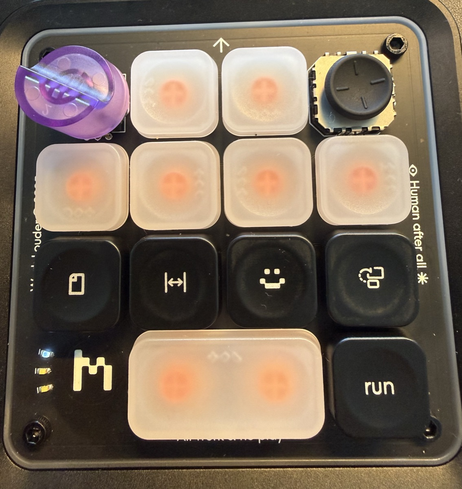

# Creator Micro 2 interoperability specification

This document records observed facts needed to interoperate with the device.
It is an implementation input, not a description of any previous program.

Every statement below is an observation on a Creator Micro 2 (firmware
0.6.2), the behavior of working code on that hardware, or Dispatch's own
design choice, and says which.

## HID transport

- Vendor ID: `0x303A`.
- Use the vendor collection at usage page `0xFF00`, usage `0x01`.
- The device exposes one HID interface whose primary usage is the keyboard
  collection (`0x01`/`0x06`). The vendor collection appears only among its
  device usage pairs, so match with `DeviceUsagePage`/`DeviceUsage`, not
  `PrimaryUsagePage`/`PrimaryUsage`. Because the interface is a keyboard,
  opening it requires an Input Monitoring grant.
- Dispatch opens the device nonexclusively, so other applications (Work
  Louder's editor, Codex) can use it at the same time.
- Keep the `IOHIDManager` alive for the complete connection lifetime.
- Reports contain 64 bytes: report identifier `0x06`, channel, payload length,
  then up to 61 bytes of UTF-8 payload.
- Channel 2 carries JSON RPC traffic, as Dispatch's working calls and
  notifications show. Other channels are not used.
- Messages may span reports. Reassemble a top-level JSON object across
  fragments.
- Calls carry an integer identifier and responses echo it; Dispatch keeps its
  identifiers below 1000 by its own convention. Notifications contain `m` and
  `p` fields.
- Other applications may share the device. Ignore responses for request
  identifiers this process does not own.

`0xE00002E2` (operation not permitted) has been observed from a missing
Input Monitoring grant and from another process holding Secure Input.

The pad's vendor collection shares its interface with a keyboard collection,
so macOS treats the whole interface as a keyboard. While any other process
holds Secure Input, the kernel marks unprivileged clients of keyboard devices
invalid: opening still succeeds, but every report write returns `0xE00002E2`
and no input arrives, whatever the privacy grants. The kernel reads the owner
from `kCGSSessionSecureInputPID` in the console session's `IOConsoleUsers`
record. Observed on 2026-09-24: Ghostty held Secure Input without showing its
lock, and after Ghostty quit the record still named its exited process; locking
and unlocking the screen cleared it and the pad reconnected without a relaunch.

Input Monitoring grants are tied to the code signature.

## Vendor methods

| Method | Form | Purpose |
| --- | --- | --- |
| `sys.version` | call | Firmware version |
| `device.status` | call | Battery, charging, and active layer |
| `fs.list` | call | List files; observed parameters `{checksum:false, rec:true}` |
| `fs.read` | call | Read a file named by `file`; returned `data` contains an encoded JSON string |
| `fs.write` | call | Write a file named by `file`; `data` is the contents as a string |
| `v.oai.thstatus` | call | Per-key lighting with a bare array of thread objects |
| `v.oai.rgbcfg` | call | Zone lighting with `keys` and `ambient` objects |
| `v.oai.hid` | notification | Control input, such as `{"k":"AG00","act":1}` |
| `kb.radial` | notification | Joystick position; not used by Dispatch |

Notifications are not callable methods.

Observed on 2026-09-24 (firmware 0.6.2) by recording raw channel-2 messages
while using each control: `v.oai.hid` carries only `k` (`"AG00"` through
`"AG18"`) and `act` (1 on press, 0 on release). Pressing the wide key sent
`AG11` then `AG10` pressed; releasing it sent `AG10` then `AG11` released. The
dial sent `AG13` and `AG14`, and pushing the joystick up sent `AG17`, each
pressed then released. Moving the joystick also sent `kb.radial` with `a`
(about 0.76 while pushed up, in turns clockwise from the right, like the
keymap's sectors), `d` (0 to 1), and fields `s`, `l`, `p`, and `o` whose
meanings are unknown.

Firmware 0.6.2 rejects an `fs.read` whose file is named by `path` with
`Missing file parameter`. `fs.list` returns an array of `{name, size}`
objects; the observed files are `keymap.json` and `smart_actions.json`.

On firmware 0.6.2, `fs.write` with
`{"file": "dispatch-probe-test.json", "data": "{\"ok\":true}"}` returned a
null result and created a new file. A later `fs.read` of the same `file`
returned the identical `data`, and `fs.list` then listed it with size 11, the
byte length of the contents.

On 2026-09-24 (firmware 0.6.2), `fs.write` also overwrote the existing
`keymap.json` (about 2 KB) and `keymap.dispatch-backup.json`: each write was
followed by an `fs.read` whose `data` decoded to the same JSON, and the pad
used the new first-layer bindings at once, without a reconnect.

## Lighting

Observed on 2026-09-24 (firmware 0.6.2), sending calls directly while
watching the pad. Each light object has `c` (color as `0xRRGGBB`), `b`
(brightness, 0–255), `e` (effect), and optionally `s` (speed) and `m`; a
per-key light also has `id`. Every call below returned `{"ok": 1}`, including
ones that changed nothing visible, so success does not show that a light
changed.

Per-key lights (`v.oai.thstatus`, `id` is the thread):

- Threads 0–9 light keys 0–9. Threads 10 and 11 light the two halves of the
  wide key. Thread 12 and threads 13–19 lit nothing.
- `e` 0: off. 1: steady. 3: pulses while cycling through colors. 4 and 6:
  pulse; no difference between them was visible side by side. 2 and 5: nothing
  lit on a key.
- Pulsing needs speed: `e` 4 with `s` 0, or without `s`, stayed dark, while
  `s` 128 and 255 pulsed. A steady light without `s` or `m` lit normally.
- `s` did not change the pulse rate. On 2026-09-30 keys 0–5 set to `e` 4 with
  `s` 1, 3, 10, 30, 100, and 255 pulsed in sync at one rate. Earlier, `e` 4 and
  `e` 6 at `s` 26, 64, and 128 all looked the same.
- Also on 2026-09-30, on keys pulsing with `e` 4: `m` 0, 1, 10, 64, 128, and
  255 looked the same; `e` 7 through 12 left the key dark. Pulsing keys and a
  pulsing underglow stayed in sync, and setting both zones to `e` 4 with `s` 1
  or 255, alternating every 10 seconds, changed no pulse rate visibly. The
  pulse appears to run on one fixed clock.
- Calls to `rpc.list`, `RPC.List`, `rpc.describe`, `sys.info`, `help`, and
  similar discovery names returned `Method not found` (404), so the firmware
  does not list its methods under a common name.

Zones (`v.oai.rgbcfg`):

- `ambient` lights the underglow. `e` 1: steady. 2: a pattern moving around
  the pad. 3: colors cycling while moving around. 5: one steady color; with
  `m` 255, steady with all colors.
- `keys` lit nothing visible, with or without per-key lights set.

Dispatch clears the pad by switching threads 0–12 and both zones off.

## Keymap

A control emits `v.oai.hid` and accepts per-key lighting only when its active-
layer binding is the corresponding `KV_OAI_AGnn` keycode. Each control reports
a press (`act: 1`) and a release (`act: 0`). For the dial and joystick the
release is not a second movement: one detent or one push is one press.

- `AG00` through `AG12`: thirteen switches in matrix order;
- `AG13` and `AG14`: dial clockwise and counter-clockwise; and
- `AG15` through `AG18`: joystick down, left, up, and right.

Observed `keymap.json` shape (firmware 0.6.2), abbreviated:

```json
{
  "version": 1,
  "activeProfileId": 0,
  "profiles": [{
    "id": 0,
    "layers": [{
      "id": 0,
      "layout": {
        "keymap": [["AG00", "AG01"], ["AG02", "…", "AG05"], ["AG06", "…", "AG09"], ["AG10", "AG11", "AG12"]],
        "encoders": [["KV_OAI_AG13", "KV_OAI_AG14", "KC_MPLY"]],
        "joystick": {"type": "RADIAL", "sectors": [{"k": "KV_OAI_AG15", "a1": 0.1875, "a2": 0.3125}]}
      },
      "lights": {}
    }]
  }],
  "macros": []
}
```

- The active profile is the entry of `profiles` whose `id` equals
  `activeProfileId`. A negative identifier is treated as zero.
- `layout.keymap` is a list of rows with widths `[2, 4, 4, 3]`.
- Each `layout.encoders` entry is `[clockwise, counterclockwise, press]`.
- `layout.joystick.sectors` bound `k` between angles `a1` and `a2`, measured
  in turns clockwise from the right: 0 is right, 0.25 down, 0.5 left, 0.75 up.
  A sector may wrap across zero (for example 0.9375 to 0.0625). The observed
  radial layout has eight sectors; the diagonals keep their own bindings.
- The observed profile has three layers; only the first carries `AGnn` codes.

Observed on 2026-09-24 (firmware 0.6.2) on a pad that had been used with the
Codex desktop app's Creator Micro support: the first layer already carried
`AG00`–`AG18` in the positions above, the joystick diagonals were `KC_P1`,
`KC_P3`, `KC_P5`, and `KC_P7`, and no Dispatch backup existed, so Dispatch had
never written this keymap. Work Louder's Input editor shows that first layer as
"reserved for ChatGPT" and does not allow editing it; the other layers remain
editable. Codex's settings offer a "Reset layout" action whose effect on
`keymap.json` has not been observed. Codex reacts to the same `AGnn` codes, so
Codex and Dispatch both receive the same presses when both are connected.

Provisioning edits only the first layer's thirteen key positions, the first
encoder's two rotation codes, and the four cardinal joystick sectors. Back up
the original keymap before the first write and verify a written keymap by
reading it back.

## Geometry



```text
 ┌──────┬──────┬──────┬──────────┐
 │ dial │  0   │  1   │ joystick │
 ├──────┼──────┼──────┼──────────┤
 │  2   │  3   │  4   │    5     │
 ├──────┼──────┼──────┼──────────┤
 │  6   │  7   │  8   │    9     │
 ├──────┼──────┴──────┼──────────┤
 │ logo │ 10 + 11     │ 12 (run) │
 │      │ (one wide)  │          │
 └──────┴─────────────┴──────────┘
```

The thirteen switches have firmware row widths `[2, 4, 4, 3]` in row-major
order, left to right, so the reading order is the matrix order. The first six
switches are the initial agent slots.

One wide keycap spans switches 10 and 11 and their two lights: a single press
reports both switches a few milliseconds apart, in either order. Dispatch
reports and lights them as one control, `key(10)`, pressed while either switch
is held. Switch 12 is the standard key at the right of the bottom row. The
pad therefore has twelve physical keys.

## Open questions

- No method for deleting a file has been observed. The probe's
  `dispatch-probe-test.json` stays on the pad that ran `fs-write-test`.
- `device.status` reported `layer_index: 1` while the first layer (id 0) was
  active, so its numbering may start at 1.
- Whether switch 12 has a light at all: thread 12 lit nothing.
- Whether the `keys` zone does anything on this firmware.
